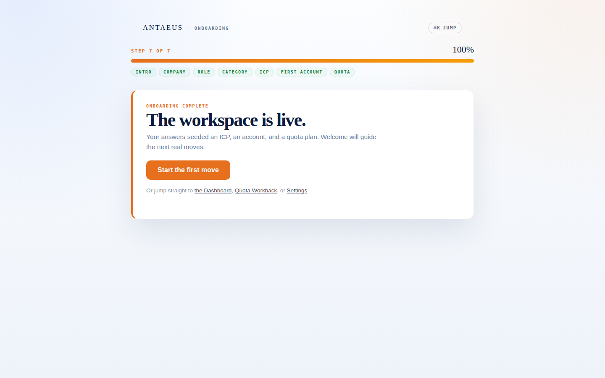
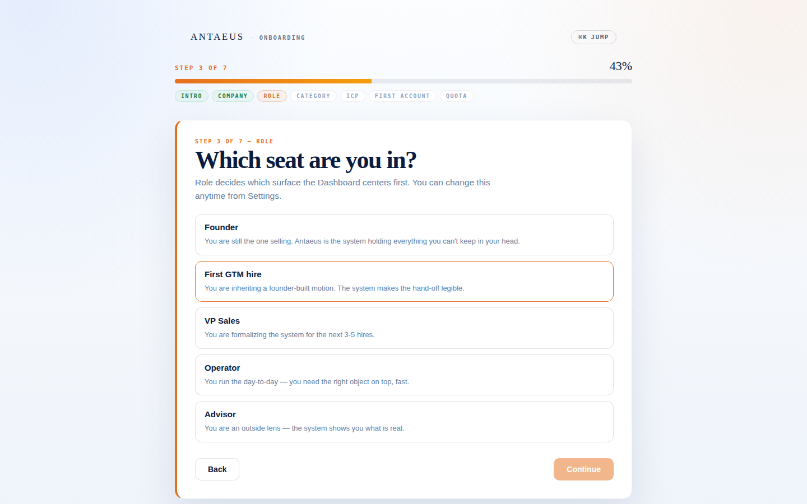
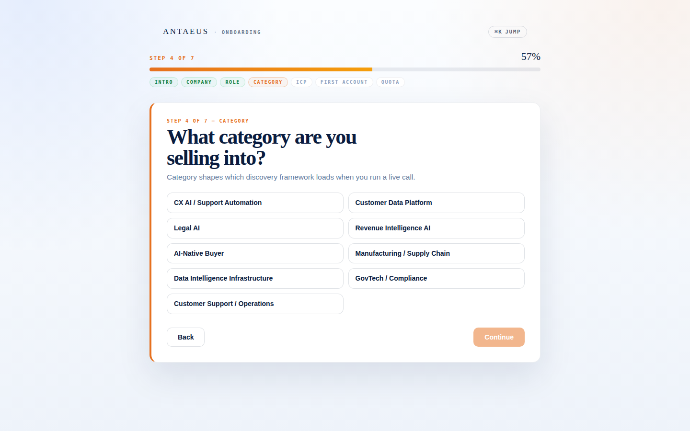
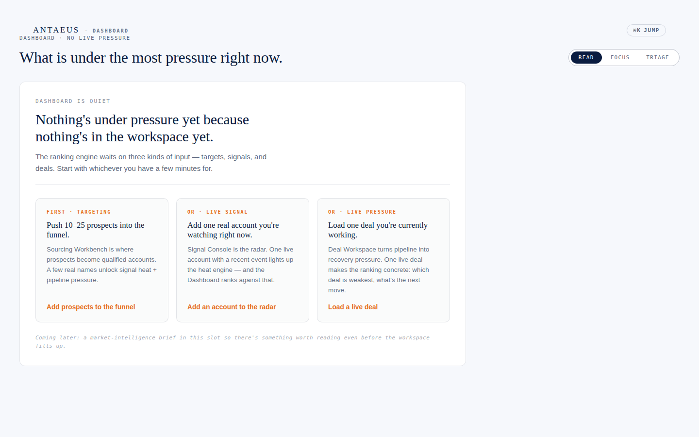
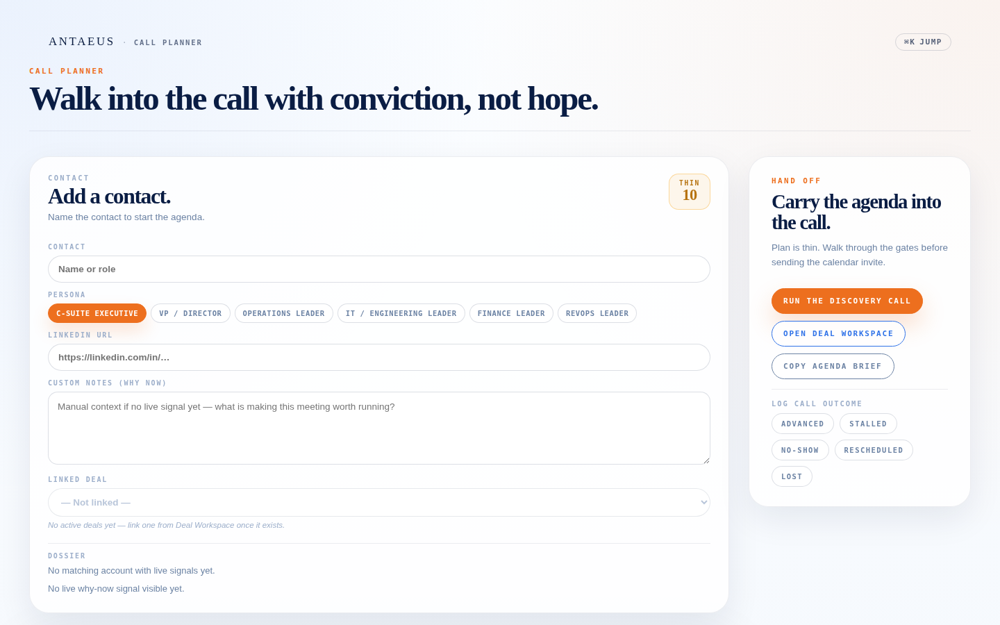
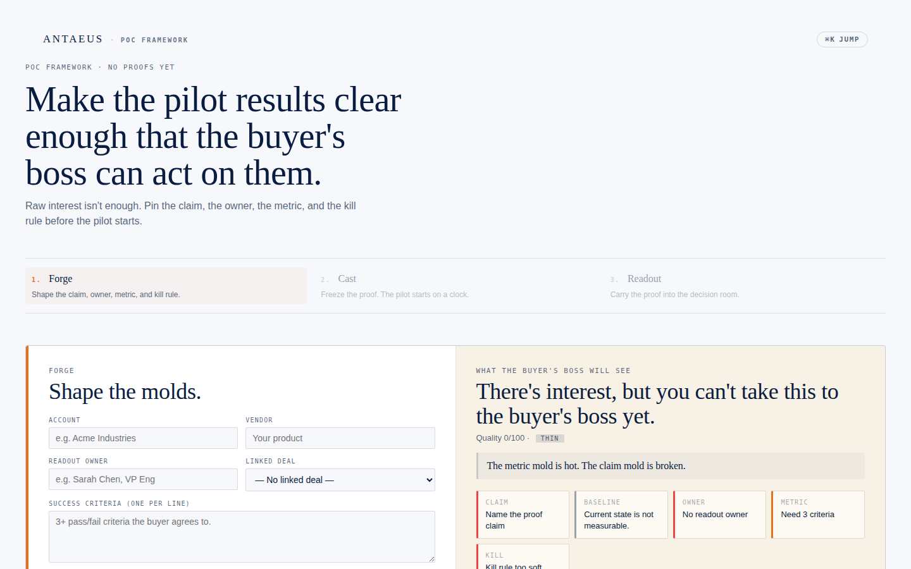
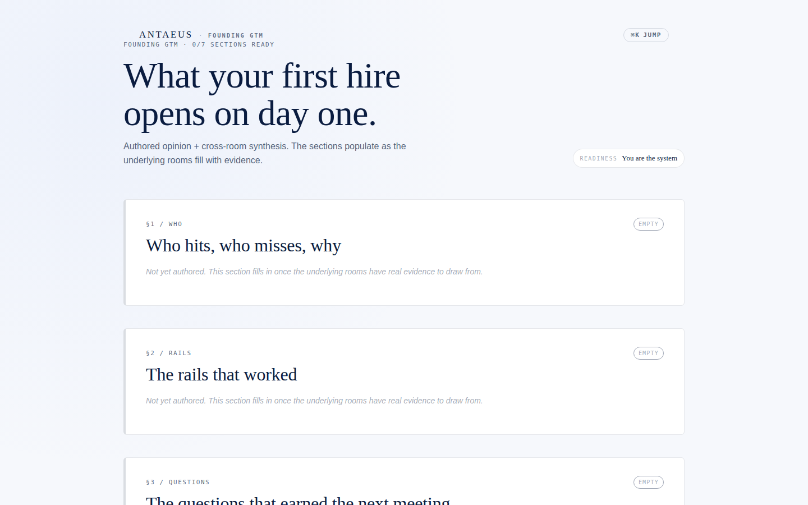

# Sarah — three calibrated walks, the pre-beta audit

**Date:** 2026-05-29
**Method:** Drove the live built app (`dist/`) in headless Chromium as Sarah Chen (per `deliverables/audit/sarah-persona-2026-05.md`), captured every step of all three calibrated walks, evaluated each surface against her stated allergies + expectations. Screenshots in `./sarah-walks-screenshots/`; probe output in `probe-output.json`.
**Build state tested:** `main` @ commit `1aa9134` (post #210 merge), fresh `npm run build:cloudflare`.

The deliverable is structured as:
1. Per-walk findings (with screenshots)
2. Cross-cutting visual patterns — including the cards-everywhere observation you flagged
3. **Pre-beta blockers, ranked** — the actionable list
4. Recommended next moves

---

## Walk 1 — first 90 seconds → first 5 minutes

**Sarah's bar:** *Does she stay past 60 seconds of typing? Does the workspace "wake up live" inside 5 minutes?*

### Verdict: PASS, with two real frictions on the way

The flow completes cleanly. Zero page errors. Every step renders correctly. The completion screen carries the explicit promise: *"The workspace is live. Your answers seeded an ICP, an account, and a quota plan."* That's exactly what the persona demands.

### What works (and works strongly)

- **Step 1 — Intro.** Serif headline carries the real one-line product sentence (the canon one, not a marketing alias). One orange `Begin` move. **Zero typing demanded.** The three quiet explainer lines below — *"The dashboard wakes up live. You can skip any step. Nothing is set anywhere."* — directly answer her #1 allergy ("each one demanded too much setup before producing anything").
- **Step 2 — Company.** Single-field, with the kicker *"Lowest-friction question first. Everything else stays optional."* The "optional" framing is critical for Sarah — it tells her she can bail at any time and still get value.
- **Step 7 → Complete.** The completion screen says *"The workspace is live."* + one orange `Start the first move` CTA + three secondary jump-links (Dashboard / Quota Workback / Settings). Clean. 

### Friction 1 — Role step's persona shapes don't include CRO

Five roles: Founder / First GTM hire / VP Sales / Operator / Advisor. **No CRO option.** Sarah's actual role doesn't appear. She has to pick "VP Sales" (which understates what she does — she runs the function, doesn't report into another sales leader) or "First GTM hire" (factually wrong — she has 14 months tenure, the company has prior reps).

For the persona who's cancelled 6 tools partly because "none integrated with how she actually thinks about a deal," getting miscategorized on step 3 of 7 is a small but real *"this thing doesn't know my role"* signal. Not a tab-closer, but a credibility ding two steps into onboarding.

**Fix:** add "CRO / Head of Revenue" to `ROLE_OPTIONS`. ~5 minute change to `src/onboarding/lib/types.ts`. Could ship today.

### Friction 2 — Category step is the verticals Sarah sells INTO; her own space (horizontal) has no fit

This is the larger of the two and it's exactly what you flagged. *"What category are you selling into?"* presents 9 vertical categories: CX AI / Customer Data Platform / Legal AI / Revenue Intelligence AI / AI-Native Buyer / Manufacturing / Data Intelligence Infrastructure / GovTech / Customer Support.

Two problems with the present design:

1. **It conflates two distinct questions** — *what do you sell* vs. *what verticals do you sell into*. Sarah's company sells **EOR / global-employment / payroll / contractor-management software**. That's the product category they *come from*. The verticals they sell INTO are *all of them* — global employment is horizontal. The current single dropdown can't express either.
2. **It forces a single pick.** Even if "EOR / global employment" were a category option, Sarah's actual answer is "we sell to founders + heads of people anywhere" — multiple verticals, often industry-agnostic.

For a CRO whose category is the literal demo workspace shipped with the product (Crossport, an EOR), getting forced into "AI-Native Buyer" is the strongest *"this doesn't get me"* signal in the whole onboarding flow.

**Fix (this PR's twin — landing next):**

- Split into two questions:
  - **Step 4a — Product category you sell from** (single pick; expand the taxonomy to include EOR / Global Employment, HR-Tech, FinTech, Vertical SaaS, Horizontal Productivity, …)
  - **Step 4b — Industries you sell into** (multi-select with "as many as are relevant") + an explicit **"Industry-agnostic"** checkbox that locks the multi-select with all-fits semantics

That matches the way Sarah and operators like her actually think about their motion.

### Cards-everywhere observation in Walk 1

- Step 1 intro: 1 outer card (the StepShell) + 3 inner explainer cards = **4 cards** on first screen
- Step 3 role: 1 outer card + 5 stacked role cards = **6 cards**
- Every step uses the same `StepShell` outer-card pattern, then stacks more cards inside

The repetition is visible across every step. The whole onboarding flow is "white card on bright field" 7 times in a row. *(Held for the "cards-everywhere" section below.)*

---

## Walk 2 — Tuesday 8:47 AM, week 4

**Sarah's bar:** *Workspace is live, ~30 deals open, 2 calls today. Does she complete one risk-intervention loop in <5 minutes with <2 acts of context re-entry?*

### Verdict: CAN'T TEST LIVE WORKSPACE — and that's itself a blocker

The demo-seed bootstrap completed without error, but the Dashboard rendered in its **empty state**: *"DASHBOARD IS QUIET — Nothing's under pressure yet because nothing's in the workspace yet."* I drove the bootstrap exactly the way `tools/qa/demo-room-bootstrap.js` documents; the legacy → new-stack handoff landed me on the new-stack Dashboard but the demo seed data did not populate it.

**This is itself a finding worth flagging as a beta blocker:** *the founder cannot currently show "Tuesday morning, week 4" to a real prospect because there is no path to a populated demo workspace on the new-stack rooms.* The persona requires it; the audit can't test it. Pre-beta requires a working demo-seed path through the new stack.

### What I can evaluate — the empty-state design + each room's posture

Empty state is well-crafted:
- Topbar kicker: *"DASHBOARD · NO LIVE PRESSURE"* — honest about the state
- Serif title still carries the room's argument: *"What is under the most pressure right now."*
- Body explains what kind of input the ranking engine needs (targets / signals / deals) + three orange CTAs (Add prospects / Add an account / Load a deal)
- Italic footer line: *"Coming later: a market-intelligence brief in this slot so there's something worth reading even before the workspace fills up."* Sets expectation honestly.
- Top-right has **READ / FOCUS / TRIAGE** mode switcher — the canon §4.2 three-mode signal is wired.

But: **three empty-state cards in a row** on the central panel. Cards-everywhere again.

### The rooms Sarah would jump to from a real risk loop

| Room | Verdict | Notes |
|---|---|---|
| **Deal Workspace** | Solid argument, empty data | *"Make the board confess where it is weak."* + one big orange `Find weakest →`. Two cards in the first fold (Deal Review left, focus right). |
| **Future Autopsy** | Sentence-shaped argument lands | *"The deal is pinned as evidence."* + *"No case pinned. Pick a deal from the ledger below."* Clean. Two empty bands. |
| **Call Planner** | Most dense + most useful | *"Walk into the call with conviction, not hope."* — 5-persona picker, agenda fields, "Run the discovery call" CTA, quality `THIN 10` chip, outcome buttons. Sophisticated.  |
| **PoC Framework** | Strong shape, dense | *"Make the pilot results clear enough that the buyer's boss can act on them."* + a Forge → Cast → Readout rail + a cream-tinted "what the buyer's boss will see" diagnosis panel showing "The metric mold is hot. The claim mold is broken." This is the room I'd most show off — substantive. But 8+ cards on screen.  |
| **Advisor Deploy** | Renders, but probe found no primary CTA | Title *"Influence is an asset. Spend it precisely."* + 6 input fields. No visible primary orange button in the captured fold. May be below the scroll. Worth confirming. |

### Cross-room re-entry — couldn't test directly

Sarah's bar says *<2 acts of context re-entry*. I couldn't measure this without a populated workspace because every room landed empty. **Re-test required after demo-seed is fixed.**

---

## Walk 3 — Week 12 handoff (Founding GTM)

**Sarah's bar:** *Does the AE leave the session with one printed-on-Sarah's-laptop artifact that's the operating playbook?*

### Verdict: SHAPE IS RIGHT, ARTIFACT IS MISSING

Structurally Founding GTM is exactly what canon §4.19 prescribes — serif title *"What your first hire opens on day one."* + the subtitle *"Authored opinion + cross-room synthesis. The sections populate as the underlying rooms fill with evidence."* + a Readiness anchor on the right (*"You are the system"* — the verdict for an empty workspace) + the seven sections (§1 Who / §2 Rails / §3 Questions / §4 Funnel truth / §5 Losses / §6 Wins / §7 Day-one rhythm).

Every section currently renders the honest empty card: *"Not yet authored. This section fills in once the underlying rooms have real evidence to draw from."* That's correct given no real data.

### What I found missing

The probe explicitly checked for the "printed on Sarah's laptop" artifact mechanism. There is **no print button, no export button, no share button** detected on the page. The room reads beautifully but offers no path to the artifact the persona explicitly demands: *"one printed-on-Sarah's-laptop artifact that's the operating playbook"* on handoff Tuesday.

Canon §4.19 itself describes a "share-link mechanic (read-mode workspace access for an external email)" as a Founding GTM primitive. The audit can't confirm that's wired (the buttons aren't there — at least not visible in the empty state). This is the **single concrete handoff gap** Walk 3 exposes.

### Cards-everywhere observation in Walk 3

Founding GTM is **the most card-dense room in the audit** — 7 identical-shape section cards stacked vertically (one per §1–§7), each with an "Empty" chip on the right. Visually it reads like a checklist of identical white rectangles. The room's mind ("authored opinion + cross-room synthesis") deserves a stronger visual hierarchy than seven copies of the same card.

---

## Cross-cutting visual patterns — the cards-everywhere problem

You named this directly. The walks make it concrete.

| Room | Visible cards in first fold | Notes |
|---|---|---|
| Onboarding step 1 (intro) | 4 (outer + 3 explainers) | Same shape, stacked |
| Onboarding step 3 (role) | 6 (outer + 5 role cards) | Same shape, stacked |
| Onboarding step 4 (category) | 11 (outer + 9 category chips + nav) | Tile grid |
| Onboarding step 7 (quota) | 1 outer + 2 field groups + a coach card | |
| Dashboard empty | 3 input-suggestion cards | Same shape |
| Deal Workspace empty | 2 cards top + 1 stat row + 1 empty card | |
| Future Autopsy empty | 2 large empty rectangles | |
| Call Planner | 2 main cards + 5 persona buttons + outcome buttons | Highest button density |
| **PoC Framework** | **2 main cards + 4 inner mold cards inside the right card + several smaller cards** | **highest card density** |
| **Founding GTM** | **1 + 7 identical section cards stacked vertically** | **most repetitive** |

**The pattern:** the rooms use card shells (white rounded rectangles on the bright field) as the dominant compositional element. When a room has more than one zone, those zones become cards. When a room has a list (roles, sections, molds), each list item becomes a card. The result is a visual rhythm of *"card, card, card"* on virtually every surface.

Three reasons this matters for Sarah:

1. **Visual sameness reads as low confidence.** Per the persona doc: *"Visual restraint = confidence. Decorative elements imply the product is trying to look like a product. Sarah reads that as weakness."* Identical card shapes across every surface is the inverse — it reads as *"product made of cards"* rather than *"a tool with deliberate visual hierarchy."*
2. **No room earns its own visual identity.** The Briefing, PoC Framework, and Founding GTM all use the same card pattern even though their jobs are radically different. Founding GTM in particular — the synthesis surface — should NOT feel like a stack of identical checklists.
3. **Buttons get lost in the card visual noise.** Sarah's expectation: *"the dominant action on every surface is the one move she came in to make."* When every panel is the same card, the primary action competes with 5 other cards for visual weight.

This is the territory the design-system pass (the work you queued for "a few days from now") needs to redesign first.

---

## Other cross-cutting observations

- **`⌘K Jump` button** appears on every screen, top-right. Consistent, good. Sarah's persona explicitly wants this kind of always-available summoned access.
- **No persistent left nav rail.** Good — canon §3 forbids hallway nav; Sarah hates it.
- **Serif headlines carry the argument on every room.** Strong. Universally on-brand.
- **Voice is consistent across rooms.** Plain sentences, no startup-shorthand nouns, no AI verbiage. The voice-rule discipline has held.
- **Button accessibility note for the design-system pass:** primary CTAs are large and orange, easy to find. Secondary buttons vary in weight/shape across rooms — sometimes ghost rectangles, sometimes underlined links, sometimes mono-style. This is one of the inconsistencies the UI kit should resolve.
- **`THIN 10` quality chip** on Call Planner is a good honest signal — operator knows the agenda is incomplete. This pattern (state-chip in topbar) is one of the strongest in the app.

---

## Pre-beta blockers — ranked

Sorted by Sarah-impact, not by engineering size.

### 🔴 BLOCKER — required before beta

1. **Demo-seed path through the new-stack rooms is broken** (Walk 2). The founder can't currently demo "Tuesday morning, week 4" because the new-stack Dashboard / Deal Workspace / Future Autopsy don't populate from the existing demo-seed bootstrap. Until this is fixed, neither sales conversations nor the persona's most important walk can be tested. *Engineering investigation needed: where does the seed land in the new stack? Does it land in localStorage but the new rooms read from cloud-canonical paths now?*

2. **Onboarding category step needs to split into "what you sell from" + "industries you sell into" (multi-select + industry-agnostic option)** (Walk 1, Friction 2). The single biggest credibility ding in the first 5 minutes. **This PR ships the audit; the implementation is the immediate next PR.**

### 🟠 SHIP-BLOCKING POLISH — should ship with beta, not after

3. **Founding GTM needs the artifact-export path** (Walk 3). Canon §4.19 prescribes a share-link mechanic. Walk 3 found no print/export/share affordance on the live room. Without it, the persona's week-12 handoff walk has no destination artifact.
4. **Role step needs a CRO option** (Walk 1, Friction 1). Trivial fix, real credibility win.

### 🟡 DESIGN-SYSTEM SCOPE — your queued work

5. **Cards-everywhere visual identity problem** is real and visible on every surface. Belongs to the design-system pass you queued. The audit numbers above are the inventory the redesign starts from. The two highest-card-density rooms (PoC Framework + Founding GTM) are also the two most strategically important synthesis surfaces — they're the ones that most need a non-card visual treatment.
6. **Secondary button visual inconsistency** across rooms (also for the UI-kit pass).
7. **Card density inside individual rooms** (PoC Framework's nested 4-mold grid; Founding GTM's 7 identical sections). These rooms need bespoke composition treatment, not the standard card stack.

### 🟢 OBSERVATIONS, NOT BLOCKERS

8. The voice + headline discipline is holding strongly across every room — keep it.
9. The empty states are honest and well-written across every room — don't replace them with skeletons or shimmer.
10. The `⌘K Jump` palette is the single most consistent UX primitive in the app — lean on it harder when the visual redesign starts.

---

## Recommended next moves (in order)

1. **Implement onboarding category split** (matches your stated fix). Separate PR; lands today.
2. **Investigate why demo-seed doesn't populate the new-stack rooms.** Either fix the seed or document the new path. This is *the* gating fix for being able to demo the product to operators.
3. **Add CRO role + the Founding GTM artifact path.** Both small, both directly close Sarah's two unmet expectations.
4. **(Your queued work, days from now)** Design-system pass — start with the cards-everywhere problem, with PoC Framework + Founding GTM as the bellwether rooms.

---

## What this audit did NOT cover

- **Authenticated production data.** This was a demo-seed walk against `dist/`, not against a real workspace. The walks measure the rooms' shape + first-impression, not the loaded data they would render with real workspace state.
- **Mobile.** Tested at 1440×900. Antaeus is desktop-only per ADR-001; mobile isn't expected to work.
- **Cross-room handoff continuity params** were not stress-tested (would require populated workspace).
- **The Briefing room** was not part of the three calibrated walks (ADR-008 boundary: out of scope for orchestration work — but it could be added to a future walk if Sarah's week-4 routine involves it).
